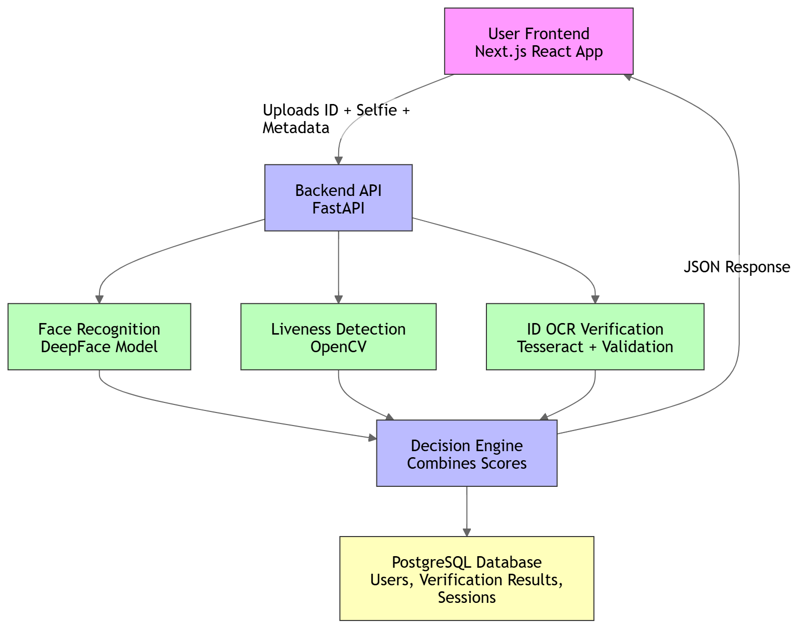

#  SafeBankID: AI-Powered Identity Verification

---

##  Abstract

SafeBankID is a multimodal identity verification framework designed to enhance security in digital banking and fintech environments. As financial services transition to digital-first onboarding, they face increasing risks from identity theft and presentation attacks.

This project proposes a unified pipeline that integrates:
- **Tesseract OCR** for automated document parsing  
- **DeepFace** for biometric matching  
- **OpenCV-based liveness detection** to ensure the physical presence of the user  

By aggregating confidence scores from these three modules, SafeBankID provides a robust, real-time verification verdict, effectively bridging the gap between user convenience and high-level security in modern digital systems.

---

##  Key Features

###  Face Recognition
- Compares live selfies with stored reference images using **DeepFace**.

###  Liveness Detection
- Confirms real user presence using **OpenCV** (blinking/head movement detection).

###  ID Verification (OCR)
- Extracts text from IDs (Passport, National ID, Driver’s License) and validates it against user-provided information.

###  End-to-End Verification
- Combines multiple AI scores to automatically approve or reject users.

###  Full-Stack Integration
Built with:
- Next.js (Frontend)
- FastAPI (Backend)
- PostgreSQL (Database)

###  Dockerized & Deployable
Ready for deployment on:
- Vercel (Frontend)
- Render / Fly.io (Backend)

---

##  System Architecture


### Frontend (Next.js)
- Collects user information
- Uploads ID images
- Captures live selfie

### Backend (FastAPI)
- Receives data
- Orchestrates AI/ML models

### ML Layer
- Face Recognition → `confidence_score`
- Liveness Detection → `liveness_score`
- OCR / ID Verification → `data_mismatch_score`

### Database (PostgreSQL)
- Stores user profiles
- Stores verification results
- Stores session history

---

##  Installation & Setup

###  Prerequisites
Ensure you have the following installed:

- Python 3.9+
- Node.js 16+
- Docker & Docker Compose
- Tesseract OCR Engine

---

##  Backend Setup (FastAPI)

```bash
cd backend
pip install -r requirements.txt
uvicorn app.main:app --reload
```

##  Frontend
```bash
cd frontend
npm install
npm run dev
```

## Docker Setup
```
docker-compose up --build
```
## Example API Response
```
{
  "verification_status": true,
  "confidence_score": 0.94,
  "liveness_score": 0.88,
  "data_mismatch_score": 0.95,
  "message": "Face and ID verified successfully"
}
```
 #  Database Schema (PostgreSQL)

## `users`
- id
- name
- dob
- email
- phone

## `biometric_verification`
- user_id
- confidence_score
- liveness_score

## `ai_verification`
- user_id
- data_mismatch_score
- final_status

## Future Improvements
 - Multi-language ID support
 - Fraud alert notifications for admins
 - Advanced deepfake detection
 - Mobile application version
 