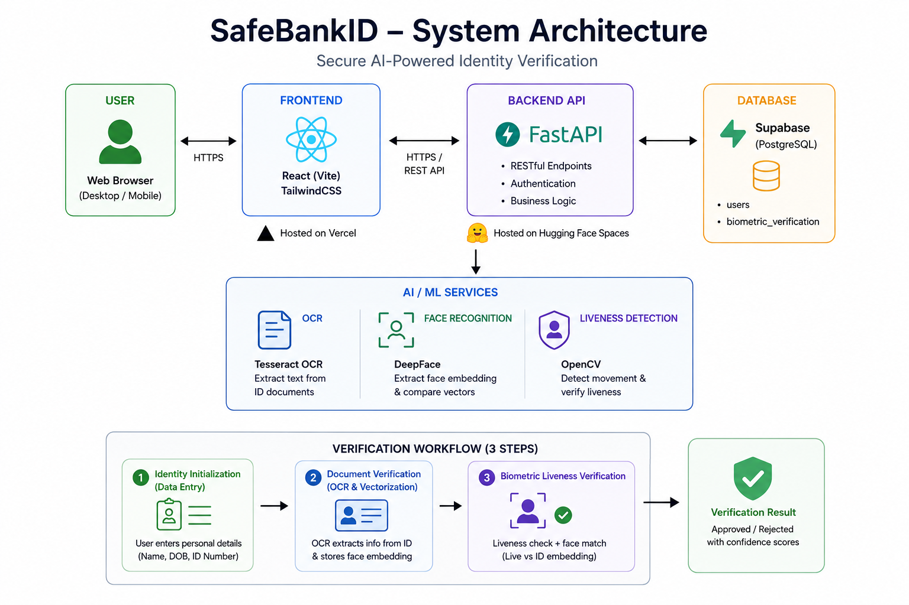

#  SafeBankID

### Secure AI-Powered Identity Verification System

SafeBankID is a full-stack AI-powered identity verification platform designed to automate and secure digital customer onboarding. The system combines Optical Character Recognition (OCR), facial recognition, and liveness detection to verify user identities while reducing fraud and manual verification efforts.

Built using React, FastAPI, PostgreSQL, DeepFace, and OpenCV, SafeBankID demonstrates how modern Artificial Intelligence and Computer Vision technologies can be integrated into real-world financial technology applications. The platform enables users to submit identification documents, complete biometric verification, and receive instant verification results through an automated and secure workflow.

The project was developed to address common challenges in Know Your Customer (KYC) processes, including lengthy verification times, human error, identity fraud, and poor user experience. By automating document validation and biometric authentication, SafeBankID provides a scalable solution that improves both security and efficiency.

---

##  Live Demo

**Frontend:** https://safe-bank-id.vercel.app/

---

##  Project Overview

Traditional identity verification often requires manual document inspection and face matching, making the process slow, expensive, and vulnerable to fraud.

SafeBankID automates this workflow through OCR, facial recognition, and liveness detection.

---

#  System Architecture

---

# 🔄 Verification Workflow

---

##  Technical Stack

### Frontend

- React (Vite)
- TailwindCSS

### Backend

- FastAPI
- Python

### Database

- PostgreSQL
- Supabase

### AI / ML

- Tesseract OCR
- DeepFace
- OpenCV

### Deployment

- Vercel
- Hugging Face Spaces

---

##  Verification Process

### Step 1: Identity Initialization

- User enters personal information
- Data is validated
- Information is stored in PostgreSQL

### Step 2: Document Verification

- User uploads an ID document
- OCR extracts text information
- Face image is extracted
- Face embedding is generated and stored

### Step 3: Biometric Verification

- User performs webcam verification
- OpenCV performs liveness detection
- DeepFace generates live embedding
- Live embedding is compared against ID embedding

### Step 4: Result

- Verification Approved / Rejected
- Confidence Score Generated
- Liveness Score Generated

---

##  Database Schema

### users

| Column | Type |
|----------|----------|
| id | int4 |
| name | text |
| dob | date |
| id_number | varchar |

### biometric_verification

| Column | Type |
|----------|----------|
| user_id | int4 |
| confidence_score | float |
| liveness_score | float |
| verified_at | timestamp |

---

##  Key Features

- OCR-based ID verification
- Facial recognition using embeddings
- Real-time liveness detection
- Automated KYC workflow
- Secure PostgreSQL storage
- REST API architecture
- Responsive React frontend

---

##  Future Improvements

- Passport verification
- Driver's license verification
- Advanced anti-spoofing models
- Multi-factor authentication
- Administrative dashboard

---

##  Author

**Bezawit Assefa**
