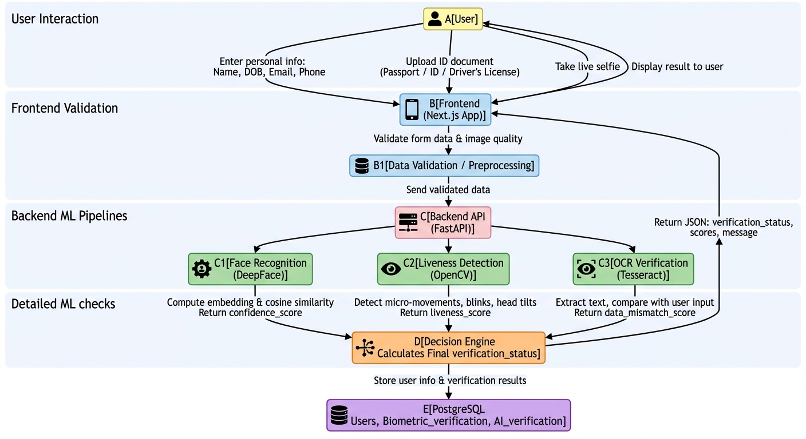

# SafeBankID

**SafeBankID** is an AI-powered identity verification system for banking and fintech applications.  
It automates secure user verification using **Face Recognition**, **Liveness Detection**, and **ID OCR**, enabling fast, real-time onboarding while reducing fraud risk.

---

##  Features

- **Face Recognition** – Compares live selfie with stored reference using DeepFace.  
- **Liveness Detection** – Confirms the user is real and live using OpenCV (blinking/head movement).  
- **ID Verification (OCR)** – Extracts text from IDs (Passport, National ID, Driver’s License) and validates against user-provided info.  
- **End-to-End Verification** – Combines scores to approve or reject users automatically.  
- **Frontend + Backend + Database** – Fully integrated system using Next.js, FastAPI, and PostgreSQL.  
- **Dockerized & Deployable** – Ready for deployment on Vercel (frontend) and Render/Fly.io (backend).

---

## 🏗 System Architecture

Here’s how the system works visually:  


**Explanation:**  
1. **Frontend (Next.js)** – Collects user info, ID upload, and live selfie.  
2. **Backend (FastAPI)** – Receives data and orchestrates ML checks.  
3. **ML Layer** – Performs:  
   - Face Recognition → `confidence_score`  
   - Liveness Detection → `liveness_score`  
   - OCR / ID Verification → `data_mismatch_score`  
4. **Database (PostgreSQL)** – Stores user info, verification results, and session history.  
5. **Response** – Backend sends result JSON back to frontend.  

---

## 🔄 Workflow Diagram

Visual representation of the verification process:  



**Step-by-step process:**  
1. User uploads ID + selfie + personal info.  
2. Frontend sends data to FastAPI backend.  
3. Backend runs ML checks:  
   - Face Recognition (matches selfie to reference)  
   - Liveness Detection (ensures real user)  
   - OCR Verification (matches ID data to input)  
4. Backend calculates final `verification_status`.  
5. Results are stored in PostgreSQL.  
6. Frontend displays verification result to the user.

---

## 💾 Database Tables (PostgreSQL)

**users**  
- id, name, dob, email, phone  

**biometric_verification**  
- user_id, confidence_score, liveness_score  

**ai_verification**  
- user_id, data_mismatch_score, final_status  

---

## 🛠 Installation & Setup

### Frontend
```bash
cd frontend
npm install
npm run dev
```
### Backend
```
cd backend
pip install -r requirements.txt
uvicorn app.main:app --reload
```
### Docker
```
docker-compose up --build
```
#### Example API Response
```
JSON
{
  "verification_status": true,
  "confidence_score": 0.94,
  "liveness_score": 0.88,
  "data_mismatch_score": 0.95,
  "message": "Face and ID verified successfully"
}
```
##  Skills Demonstrated
- **AI / ML** – Face Recognition, Liveness Detection, OCR, score aggregation

- **Backend / APIs** – FastAPI, PostgreSQL, Docker, REST endpoints

- **Frontend / UX** – Next.js, TailwindCSS, responsive UI, file uploads

- **DevOps / Deployment** – Dockerization, Vercel (frontend), Render/Fly.io (backend)

- **System Design & Security** – End-to-end workflow, secure verification

- **Professionalism / Documentation** – GitHub repo, architecture diagrams, workflow explanation

## Future Improvements

- Multi-language support for IDs
- Fraud alert notifications for admins
- Advanced AI for enhanced liveness detection
- Mobile app support